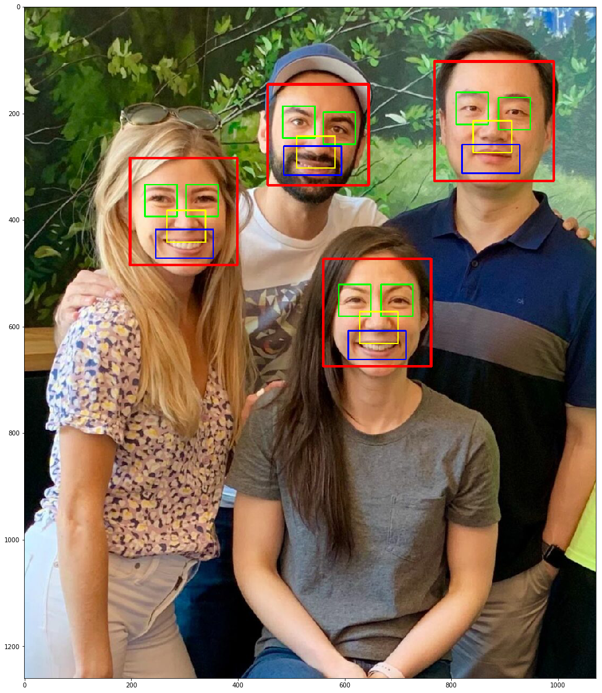
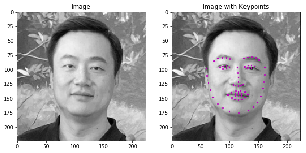
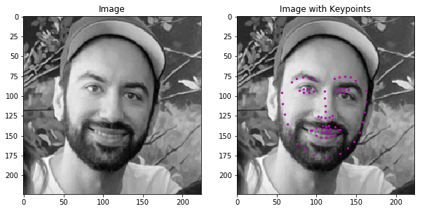
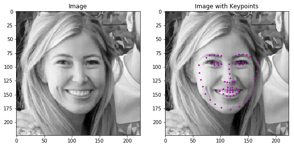
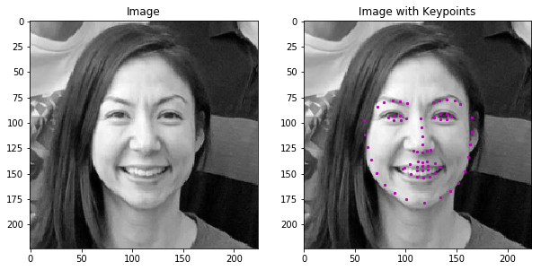
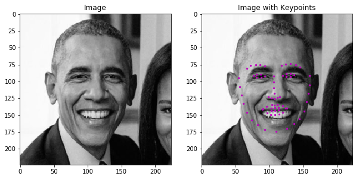
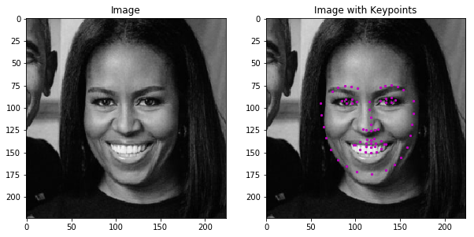

# Udacity Computer Vision ND Facial Keypoint Detection Project
In this project, you’ll combine your knowledge of computer vision techniques and deep learning architectures to build a facial keypoint detection system. Facial keypoints include points around the eyes, nose, and mouth on a face and are used in many applications. These applications include: facial tracking, facial pose recognition, facial filters, and emotion recognition. 
Your completed code should be able to look at any image, detect faces, and predict the locations of facial keypoints on each face; examples of these keypoints are displayed below.

  

The pipeline consists of:
1. Detecting faces on the image with OpenCV Haar Cascades.
2. Detecting 68 facial keypoints with CNN with architecture based on [this paper](https://arxiv.org/pdf/1710.00977.pdf).

## Output results

  
  
  
  
  
  

  
  
  

